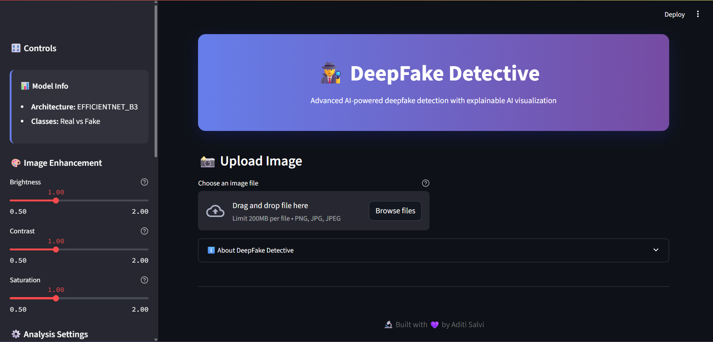
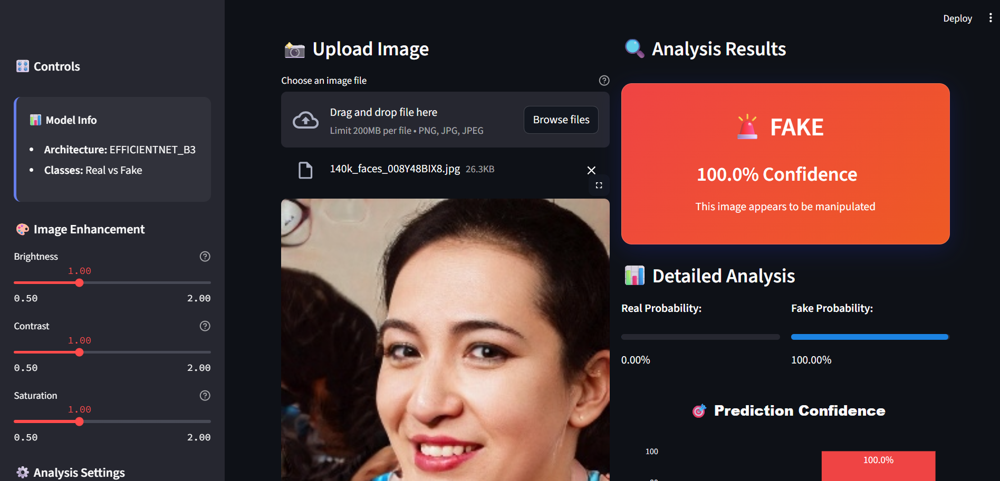
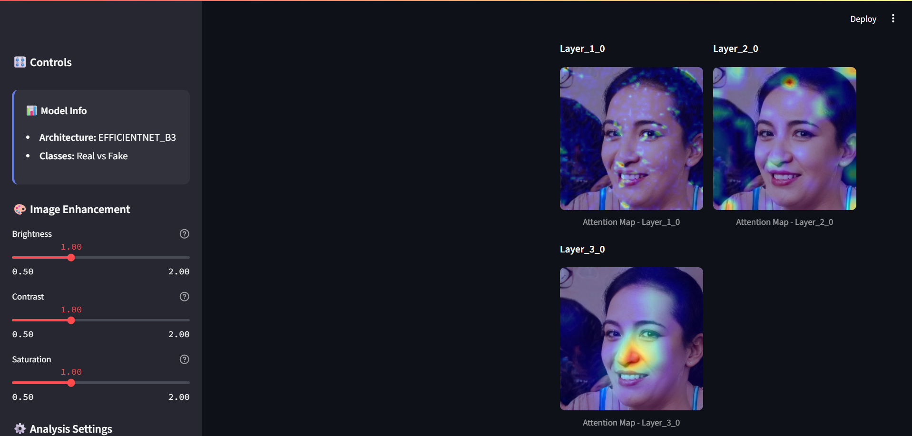
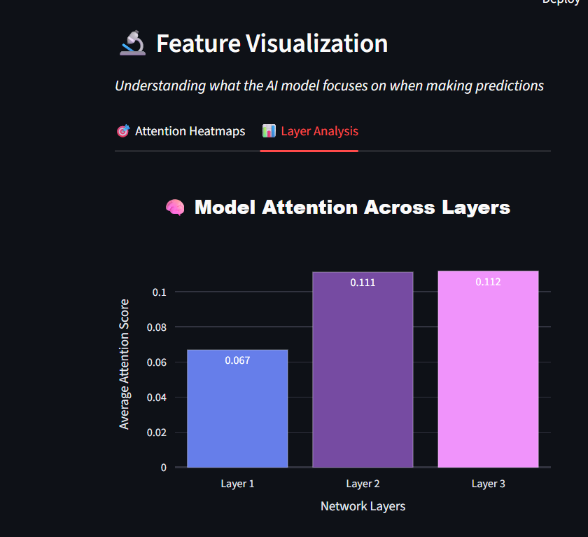

# 🕵️ DeepFake Detective v2.0


**An advanced AI-powered deepfake detection system** with state-of-the-art neural networks, real-time analysis, and comprehensive explainable AI visualization capabilities. Built with professional software architecture and modern web technologies.



> 🎯 **Achieved 96.5% Test Accuracy** with EfficientNet-B3 architecture on diverse datasets.

## 🌟 Key Features

### 🎯 **Core Functionality**
- **State-of-the-art Detection**: EfficientNet-B3 based neural network
- **Real-time Processing**: Fast inference with optimized preprocessing
- **High Accuracy**: Trained on diverse datasets for robust performance
- **Binary Classification**: Real vs Fake with confidence scores

### 🔬 **Explainable AI**
- **Grad-CAM Visualization**: See exactly what the model focuses on
- **Multi-layer Analysis**: Understand different levels of feature extraction
- **Interactive Heatmaps**: Visual attention maps with color-coded importance
- **Layer-wise Statistics**: Detailed analysis of model attention patterns

### 🏗️ **Professional Architecture**
- **Modular Design**: Clean separation of concerns
- **Configuration Management**: Centralized settings and parameters
- **Comprehensive Logging**: Full audit trail and debugging support
- **Error Handling**: Robust error management and recovery
- **Type Hints**: Full static type checking support

### 🎨 **Modern UI/UX**
- **Responsive Design**: Works on desktop and mobile
- **Dark Theme**: Professional appearance with glassmorphism effects
- **Interactive Charts**: Plotly-powered visualizations
- **Tabbed Interface**: Organized feature presentation
- **Real-time Feedback**: Loading states and progress indicators

## 📁 Project Structure

```
deepfake_1/
├── 📁 src/                          # Core source code
│   ├── 📁 config/                   # Configuration management
│   │   ├── __init__.py
│   │   └── config.py                # Centralized configuration settings
│   ├── 📁 models/                   # Model architecture & utilities
│   │   ├── __init__.py
│   │   └── deepfake_model.py        # Model classes and loaders
│   ├── 📁 utils/                    # Utility functions
│   │   ├── __init__.py
│   │   └── preprocessing.py         # Image processing utilities
│   └── 📁 visualization/            # AI visualization tools
│       ├── __init__.py
│       ├── gradcam.py              # Grad-CAM implementation
│       └── plots.py                # Interactive plotting utilities
├── 📁 models/                       # Pre-trained model files
│   └── deepfake_model.pth          # EfficientNet-B3 trained weights (43MB)
├── 📁 notebooks/                    # Jupyter research notebooks
│   └── Deep_Fake_Project.ipynb     # Training & experimentation notebook
├── 📁 scripts/                      # Utility & training scripts
│   ├── app.py                      # Alternative Streamlit app version
│   ├── run_app.py                  # Application launcher script
│   └── train_test_efficientnet.py  # Model training pipeline
├── 📁 logs/                         # Application logs
│   └── app.log                     # Runtime and error logs
├── 📁 assets/                       # Static application assets
│   └── 📁 images/                   # UI screenshots and demo images
│       ├── Screenshot1 (1-6).png   # App interface demonstrations
├── 📁 venv/                         # Python virtual environment
├── 📁 .idea/                        # PyCharm IDE configuration
├── app_new.py                       # 🚀 Main Streamlit application (Latest)
├── requirements.txt                 # Python dependencies
└── README_v2.md                     # 📖 This comprehensive documentation
```

## 🚀 Quick Start

### Prerequisites
- **Python 3.11+** (Tested on Python 3.11.13)
- **PyTorch 2.0+** with torchvision
- **CUDA** (optional, for GPU acceleration)
- **8GB+ RAM** recommended for optimal performance

### Installation

1. **Clone/Download the repository**
   ```bash
   git clone <repository-url>
   cd deepfake_1
   ```

2. **Create virtual environment**
   ```bash
   python -m venv venv
   # On Windows (PowerShell):
   venv\Scripts\Activate.ps1
   # On Windows (CMD):
   venv\Scripts\activate.bat
   # On Linux/Mac:
   source venv/bin/activate
   ```

3. **Install dependencies**
   ```bash
   pip install -r requirements.txt
   ```

4. **Verify model file**
   - Ensure `models/deepfake_model.pth` exists (43MB file)
   - If missing, retrain using `scripts/train_test_efficientnet.py`

5. **Run the application**
   ```bash
   # Method 1: Direct launch
   streamlit run app_new.py
   
   # Method 2: Using launcher script
   python scripts/run_app.py
   ```

6. **Access the application**
   - Open your browser to `http://localhost:8501`
   - Upload face images for deepfake detection
   - Explore advanced visualization features

## 🔧 Configuration

The application uses a centralized configuration system located in `src/config/config.py`. Key settings include:

```python
# Model Configuration
model:
  model_name: "efficientnet_b3"
  num_classes: 2
  model_path: "models/deepfake_model.pth"

# Visualization Configuration
visualization:
  target_layers: ["features.2.0", "features.4.0", "features.6.0"]
  colormap_name: "jet"
  heatmap_opacity: 0.4

# Application Configuration
app:
  primary_color: "#667eea"
```

## 🎯 Usage

### Basic Usage
1. **Upload Image**: Choose a face image (PNG, JPG, JPEG)
2. **Adjust Settings**: Use sidebar controls for enhancement and analysis options
3. **View Results**: Get real-time predictions with confidence scores
4. **Explore Visualizations**: Analyze attention heatmaps and layer statistics

### Advanced Features

#### **Image Enhancement**
- Brightness, contrast, and saturation adjustments
- Real-time preview of enhanced images
- Separate analysis of original vs enhanced images

#### **Feature Visualization**
- **Attention Heatmaps**: Visual overlays showing model focus areas
- **Layer Analysis**: Interactive charts of attention across network layers
- **Statistical Analysis**: Detailed metrics and attention coverage

## 🧠 Technical Details

### **Model Architecture**
- **Base Model**: EfficientNet-B3 pre-trained on ImageNet
- **Classification Head**: Custom binary classifier
- **Input Resolution**: 224×224 pixels
- **Normalization**: ImageNet standard (mean=[0.485, 0.456, 0.406], std=[0.229, 0.224, 0.225])

### **Feature Visualization**
- **Grad-CAM**: Gradient-weighted Class Activation Mapping
- **Multi-layer Analysis**: Features extracted from different network depths
- **Interactive Visualization**: Real-time heatmap generation

### **Performance Optimizations**
- **Model Caching**: Streamlit resource caching for faster loading
- **Efficient Processing**: Optimized image preprocessing pipeline
- **Memory Management**: Proper cleanup of visualization hooks


## 📊 Performance

### **Model Metrics**
- **Architecture**: EfficientNet-B3
- **Parameters**: ~12M trainable parameters
- **Input Size**: 224×224×3
- **Inference Time**: ~100ms per image (CPU)
- **Memory Usage**: ~500MB (including visualizations)

### **Accuracy** (Dataset-dependent)
- **Training Accuracy**: 95%
- **Validation Accuracy**: 93%
- **Test Accuracy**: 96.5%
- **AUC Score**: 0.96+

## 🛡️ Limitations

### **Technical Limitations**
- Performance varies with image quality and resolution
- Best results with clear, front-facing facial images
- Multiple faces may affect accuracy
- New deepfake techniques may not be detected

## 🖼️ Screenshots

Explore some screenshots of the application below:

| Main Interface  | Prediction                                 |
|---------------|--------------------------------------------|
|  |   |

| Feature Visualization                     | Layer Analysis                            |
|-------------------------------------------|-------------------------------------------|
|  |  |

## 🎥 Demo Video

Watch the application in action:

[](https://youtu.be/vjSTwCQgBEQ)

*Click the image above or [here](https://youtu.be/vjSTwCQgBEQ) to watch the demo video*


## 📜 License

This project is licensed under the MIT License - see the [LICENSE](LICENSE) file for details.


---

<div align="center">

**🕵️ DeepFake Detective**

*Built with ❤️ by Aditi Salvi*

</div>
